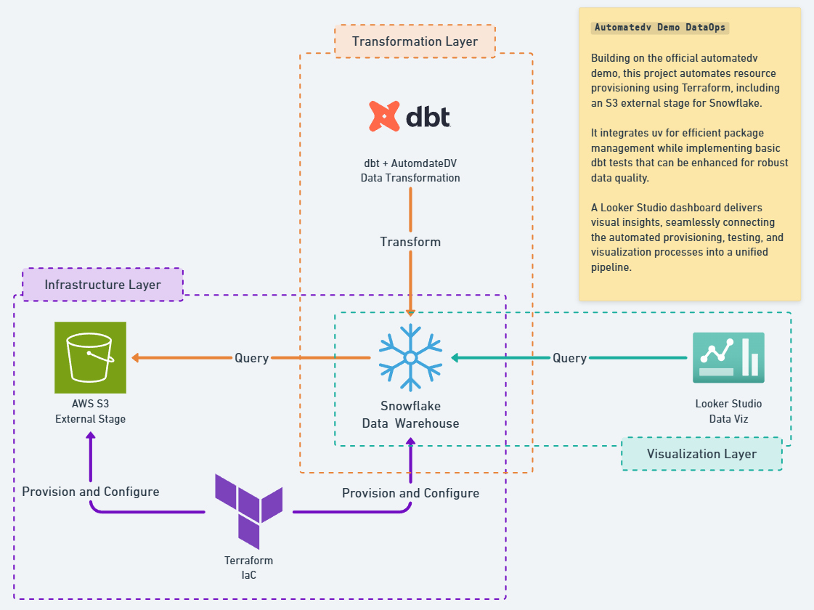

# Automatedv Demo Dataops



> [Looker Report](https://lookerstudio.google.com/s/vN_cQWPGOr0)

___

This project builds on the official automatedv demo by implementing infrastructure management, basic data testing, and visualization:

- **Infrastructure Automation:** Terraform now automates the provisioning of resources for the Snowflake Data Warehouse, including the setup of an AWS S3 external stage.
- **Data Transformation and Quality Assurance:** The dbt project has been enhanced with basic tests and unit tests, a first step towards robust and reliable transformation processes.
- **Visualization Integration:** A basic dashboard has been integrated through Looker Studio, enabling straightforward and immediate data visualization.
- **Efficient Package Management:** Integration of uv as a package manager streamlines package and version management, enhancing overall project maintainability.
___


## Run The Project

### Clone this repo

```bash
git clone https://github.com/caidam/automatedv-demo.git
```

### Set Up Terraform

Follow steps from [readme in terraform folder](/terraform/README.md) to generate ssh keys, create and configure service user in snowflake

create and populate `terraform.tfvars` file following `terraform.tfvars.template` structure

```bash
terraform init
terraform validate
terraform apply
```
clean up when you're done experimenting:
```bash
terraform destroy
```
### Set Up dbt

Move to the dbt project folder
```bash
cd automate-dv-demo
```

- Create `profiles.yml` file following `profiles.yml.template` structure
- update `DBT_PROFILES_DIR` with `profiles.yml`'s path

```bash
export DBT_PROFILES_DIR=$(pwd)
```

> this is done for ease of use here but is not recommended in real world scenarios, avoid storing your credentials in the project folder and if so make sure the file is not tracked by git

- Sync uv and test

```bash
uv sync
uv run dbt debug
```

- Or initialize uv from scratch

Make sure you are in the dbt project folder
```bash
cd automate-dv-demo
```

Reset uv project:
```bash
rm pyproject.toml uv.lock .python-version
rm -rf .venv
```

Init uv project inside existing folder with relevant python version
```bash
uv init --python 3.9 # use this version to avoid compatibility issues
```

Install dependencies
```bash
uv add dbt-core dbt-snowflake
uv sync
```

- Start working with dbt

Make sure to run your command in the correct directory.
> In VSCode, you may need to update your python interpreter, point it to the `.venv` created by uv.

Test dbt is working
```bash
uv run dbt --version
uv run dbt debug
uv run dbt deps
```

> useful tip: alias the `uv run dbt` command

```bash
alias dbt='uv run dbt'

# then you can run your commands normally
dbt run -s tag:raw
dbt run
dbt test -s test_type:unit
```